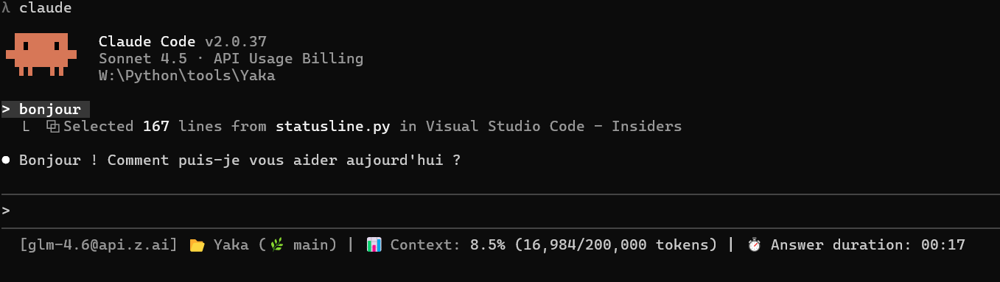

# Claude Code tips

Trucs et astuces concerant l'utilisation de Claude Code.

- [Barre d'état dynamique](#barre-détat-dynamique)
- [Notifications sonores](#notification-sonore)

---

## Barre d'état dynamique

Ce script permet d'afficher en bas de son interface `Claude Code` une barre d'état qui indique des informations utiles :

- Modèle et base URL actuellement utilisé
- Répertoire et branche GIT de travail
- Utilisation du contexte
- Durée de traitement de la dernière réponse

### Capture d'écran



### Installation

#### Prérequis

- Avoir `Python` installé et disponible via la commande `python`.

#### Copie du fichier

- Mettre le fichier `claude-statusline.py` dans le répertoire `~/.claude` (exemple : `C:\Users\Yajusta\.claude`).

#### Paramétrage du contexte

- Editer le fichier `claude-statusline.py` et modifier la variable `CONTEXT_LIMIT` pour mettre la taille du contexte du modèle utilisé.

#### Configuration de Claude Code

- Ouvrir le fichier `~/.claude/settings.json` (exemple : `C:\Users\Yajusta\.claude\settings.json`) et cherchez la partie `statusLine`. Si elle n'existe pas, l'ajouter.
- Remplir avec :

```json
  "statusLine": {
    "type": "command",
    "command": "python \"C:\\Users\\Yajusta\\.claude\\claude-statusline.py\""
  }
```

## Notification sonore

Dans le fichier `~/.claude/settings.json` il est possible de paramétrer des "hooks" : des actions effectuées à chaque fois qu'un évènement particulier se produit.
Grâce aux hooks `Notification` et `Stop`, on peut provoquer le fait de jouer un son.

Voici comment faire sous Windows :

- Trouver un fichier `.wav` ou `.mp3` que vous êtes prêt à entendre des milliers de fois.
- Le placer dans un répertoire comme par exemple `C:\Users\Yajusta\Music\`.
- Editer le fichier `~/.claude/settings.json` et ajouter / modifier les hooks `Notification` et `Stop` de la façon suivante :

```json
  "hooks": {
    "Notification": [
      {
        "hooks": [
          {
            "type": "command",
            "command": "powershell.exe -c \"(New-Object Media.SoundPlayer 'C:\\Users\\Yajusta\\Music\\hook-notification.wav').PlaySync()\""
          }
        ]
      }
    ],
    "UserPromptSubmit": [
      {
        "hooks": []
      }
    ],
    "Stop": [
      {
        "hooks": [
          {
            "type": "command",
            "command": "powershell.exe -c \"(New-Object Media.SoundPlayer 'C:\\Users\\Yajusta\\Music\\hook-stop.wav').PlaySync()\""
          }
        ]
      }
    ],
    "SubagentStop": [
      {
        "hooks": []
      }
    ]
  }
  ```
